<!-- ============ HERO BANNER ============ -->

 

<!-- ============ TYPING ANIMATION ============ -->

 

 

## 👋 About Me

I'm **Hiren Kanzariya**, an **AI/ML & Data Analyst** based in Gujarat, India, focused on turning raw data into practical, intelligent solutions. I work primarily with **Python** and **SQL**, using **Pandas** and **NumPy** for data wrangling, **Scikit-learn** for building machine learning models, and clear **data visualization** to communicate insights that matter.

- 🔍 I enjoy the full pipeline — cleaning messy data, exploring it, training models, and evaluating what actually works.
- 🧠 Strong believer in solving real problems over chasing buzzwords — practical machine learning and data analysis over hype.
- 🛠️ I build small, focused projects to keep learning by doing, not just reading.
- 📊 Comfortable moving between a Jupyter notebook, a SQL query, and a dashboard in the same afternoon.
- 🌱 Currently sharpening my skills in AI Agents, Generative AI, and Data Engineering.

 

## 🧠 Neural Network & Tech Visualization

 

## 💻 Live Pipeline Terminal

 

## 🧰 Tech Stack

**Programming**

**Data Analysis**

**Machine Learning**

**Tools**

 

## 📊 GitHub Statistics

 

 

## 🌱 Contribution Activity

> Consistency → Growth → Impact

 

## 🚀 Featured Projects

<table>
  <tr>
    <td width="50%" valign="top">
      <h3>📈 Sales Data Analysis Dashboard</h3>
      
End-to-end analysis of retail sales data — cleaning, exploratory analysis, and an interactive Power BI dashboard highlighting revenue trends and top-performing regions.

      

        
        
        
      

      <a href="https://github.com/hirenkanzariya">🔗 Repository</a>
    </td>
    <td width="50%" valign="top">
      <h3>🤖 Customer Churn Prediction</h3>
      
A classification model that predicts customer churn using Scikit-learn, with feature engineering, model comparison, and evaluation using precision, recall, and ROC-AUC.

      

        
        
        
      

      <a href="https://github.com/hirenkanzariya">🔗 Repository</a>
    </td>
  </tr>
  <tr>
    <td width="50%" valign="top">
      <h3>🗃️ SQL Data Exploration Toolkit</h3>
      
A collection of SQL queries and stored procedures for exploring, cleaning, and aggregating large relational datasets, built around real business questions.

      

        
        
      

      <a href="https://github.com/hirenkanzariya">🔗 Repository</a>
    </td>
    <td width="50%" valign="top">
      <h3>📉 Exploratory Data Analysis Toolkit</h3>
      
A reusable Python toolkit for fast exploratory data analysis — automated summary statistics, missing-value reports, and visualization with Matplotlib and Seaborn.

      

        
        
        
      

      <a href="https://github.com/hirenkanzariya">🔗 Repository</a>
    </td>
  </tr>
</table>

> ℹ️ Replace the project names, descriptions, tech stacks, and links above with your actual repositories.

 

## 📚 Currently Learning

| Topic | Status |
|---|---|
| 🤖 AI Agents | ██████░░░░ In progress |
| ✨ Generative AI | █████░░░░░ In progress |
| 🧠 Machine Learning | ███████░░░ Actively practicing |
| 🔬 Deep Learning | ████░░░░░░ Just started |
| 🗄️ Data Engineering | ████░░░░░░ Just started |
| 🧮 Advanced SQL | ██████░░░░ In progress |

 

## 🎯 Current Focus — What I'm Working On

- 🧪 Machine learning projects that solve real, well-defined business problems
- 📊 Data analysis work turning raw datasets into clear, actionable insights
- 🤖 AI-powered applications that combine models with usable interfaces
- 🗃️ SQL projects for data cleaning, transformation, and reporting
- 🧩 Practical AI solutions built end-to-end, from data to deployment

 

## 📬 Connect With Me

> ℹ️ Replace the links above (GitHub, LinkedIn, Email, Portfolio, YouTube) with your real profile URLs.

 

<!-- ============ FOOTER ============ -->

