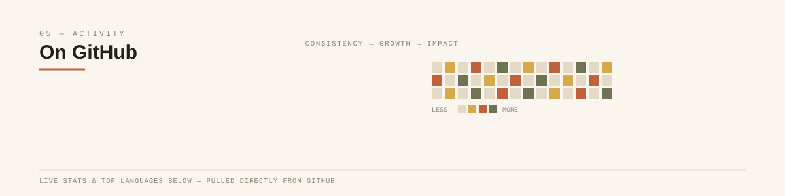

 

 

 

 

> ℹ️ *Project names, descriptions, and tech stacks above reflect the current README. Swap in your live repository links below whenever they're ready.*

<a href="https://github.com/hirenkanzariya">🔗 github.com/hirenkanzariya</a>

 

 

 

  

  

 

 

 

> ℹ️ *Replace the GitHub, LinkedIn, Email, Portfolio, and YouTube links above with your real URLs.*

 

